## Часть 1. Инструмент ipcalc 
- Запустить виртуальную машину (далее — ws1) 

### 1.1 Сети и маски
- Определите и запишите в отчете:
1) сетевой адрес 192.167.38.54/13  
 
2) преобразование маски 255.255.255.0 в префиксную и 
двоичную, /15 в обычную и двоичную, 
11111111.11111111.11111111.11110000 в обычную 
и префиксную.

Чтобы преобразовать маску подсети в префиксную, 
нужно записать её в двоичный вид и посчитать количество единиц. Запись префиксного варианта 
обозначения происходит так: пишется косая черта "/" и после неё указывается количество единиц.
 
 Если маска подсети 255.255.255.0 переведена в двоичный вид, то в ней будет 24 единицы. 
Значит, префиксный вариант обозначения будет "/24" — в подсети используется префикс 24. 
 - 255.255.255.0 = 11111111.11111111.11111111.0 
 - /24 - перфексная 
 - 11111111.11111111.11111111.11110000 - 255.255.255.240
 - /28 - префиксная 
3)  минимальный и максимальный хост в сети 12.167.38.4 с масками: /8 , 11111111.11111111.00000000.00000000 , 255.255.254.0 и /4
- 12.167.38.4  
 
 
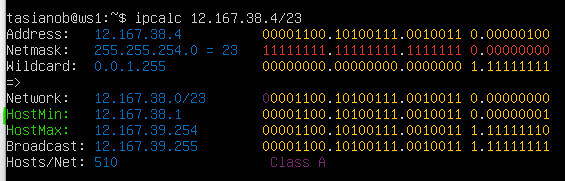 
 
### 1.2. локальный хост
Определите и запишите в отчет, можно ли получить доступ к приложению, работающему на локальном хосте, со следующих IP-адресов: 194.34.23.100 , 127.0.0.2 , 127.1.0.1 , 128.0.0.1.
- 194.34.23.100: Доступ невозможен, если приложение не настроено на прослушивание внешних интерфейсов.

- 127.0.0.2: Доступ возможен, так как это loopback-адрес, но только если приложение настроено на прослушивание этого адреса.

- 127.1.0.1: Доступ возможен, так как это loopback-адрес, но только если приложение настроено на прослушивание этого адреса.

- 128.0.0.1: Доступ невозможен, так как это не loopback-адрес, и приложение, скорее всего, не настроено на прослушивание внешних интерфейсов.

   Если IP-адрес начинается с 127., это loopback-адрес. 
Весь диапазон 127.0.0.0/8 зарезервирован для loopback-адресов.
Loopback-адреса — это специальные IP-адреса, которые используются для тестирования и взаимодействия с самим собой (локальным устройством). Они не передаются по сети и всегда указывают на устройство, с которого выполняется запрос.   

Использовал утилиту telnet для подключения к приложению запущенному на локальном хосте. Но так как, ничего у меня не было запущенно локально, запустил ,<b>sudo python3 -m http.server 80 что запускает HTTP сервер на 80 порту.  

### 1.3. Диапазоны и сегменты сети

1) <b>какие из перечисленных IP-адресов можно использовать как публичные, а какие только как частные: 10.0.0.45 , 134.43.0.2 , 192.168.4.2 , 172.20.250.4 , 172.0.2.1 , 192.172.0.1 , 172.68.0.2 , 172.16.255.255 , 10.10.10.10 , 192.169.168.1
- 10.0.0.45 - частный  

- 134.43.0.2 - публичная 

- 192.168.4.2 - частная 

- 172.20.250.4 - частный 

- 172.0.2.1 - публичный 

- 192.172.0.1 - публичный  

- 172.68.0.2 - публичный 

- 172.16.255.255 - частный  

- 10.10.10.10 -частный  
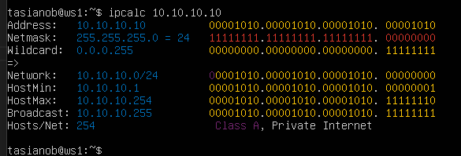

- 192.169.168.1 - публичный  

2) <b>какие из перечисленных IP-адресов шлюза возможны для сети 10.10.0.0/18 : 10.0.0.1 , 10.10.0.2 , 10.10.10.10 , 10.10.100.1 , 10.10.1.255 

- 10.0.0.1 - не возможен (другая сеть)
- 10.10.0.2 - возможен 
- 10.10.10.10 - возможен
- 10.10.100.1 - не возможен
- 10.10.1.255 - взможен 

## Часть 2. Статическая маршрутизация между двумя машинами

Запустить две виртуальные машины (далее — ws1 и ws2) 

- Опишите сетевой интерфейс, соответствующий внутренней сети на обеих машинах, и установите следующие адреса и маски: ws1 — 192.168.100.10 , маска */16 *, ws2 — 172.24.116.8 , маска /12

- Добавьте в отчет скриншоты измененного файла etc/netplan/00-installer-config.yaml для каждой машины. 

- Выполните netplan apply команду для перезапуска сетевой службы. 

### 2.1 Добавление статического маршрута вручную
- Добавьте статический маршрут от одной машины к другой и обратно с помощью
ip r add команда. 
 
  Использую команду <mark> sudo ip addr </mark> **"cеть или подсеть"** <mark> via</mark> ШЛЮЗ 

 

 

Использую команду ip r для отображение всех роутов.(dev укаывает что для марштура будет использоваться интерфейс enp0s3) 

 

 

- Проверьте соединение между машинами. 
команда ping  

### 2.2. Добавление статического маршрута с сохранением.
- Добавьте статический маршрут с одной машины на другую с помощью файла /etc/netplan/00-installer-config.yaml
 
- Проверьте соединение между машинами. 

## Часть 3. Утилита iperf3.

### 3.1 Скорость соединения
- Конвертируйте и запишите результаты в отчет: 8 Мбит/с в МБ/с, 100 МБ/с в Кбит/с, 1 Гбит/с в Мбит/с

1 байт = 8 бит,

1 мегабайт (МБ) = 1024 килобайт (КБ),

1 килобайт (КБ) = 8 килобит (Кбит).

1 гигабит (Гбит) = 1000 мегабит (Мбит).

* 1 Гбит/с = 1000 Мбит/с
* 8 Мбит/c = 1 Мбайт/с
* 100 МБ/с = 819200Кбит/с (800000)
819,200 Кбит/с — это точный расчет в двоичной системе.

800,000 Кбит/с — это упрощенный расчет в десятичной системе.

Оба варианта могут встречаться, но в информатике и технических расчетах правильнее использовать 819,200 Кбит/с.

### 3.2. утилита iperf3
- Измерьте скорость соединения между ws1 и ws2

Использовал команды <b> iperf3 -s</b> для запуска сервера , и <b> iperf3 -c</b> client и ip сервера куда будем подключатся для измерения скорости.  

## Часть 4. Сетевой брандмауэр

### 4.1. утилита iptables 

**Создай файл /etc/firewall.sh, имитирующий файрвол, на ws1 и ws2:**

 1) На ws1 примени стратегию, когда в начале пишется запрещающее правило, а в конце пишется разрешающее правило (это касается пунктов 4 и 5)
 2) На ws2 примени стратегию, когда в начале пишется разрешающее правило, а в конце пишется запрещающее правило (это касается пунктов 4 и 5).
 3)  Открой на машинах доступ для порта 22 (ssh) и порта 80 (http).
 4)  Запрети echo reply (машина не должна «пинговаться», т. е. должна быть блокировка на OUTPUT).
 5)  Разреши echo reply (машина должна «пинговаться»). 

 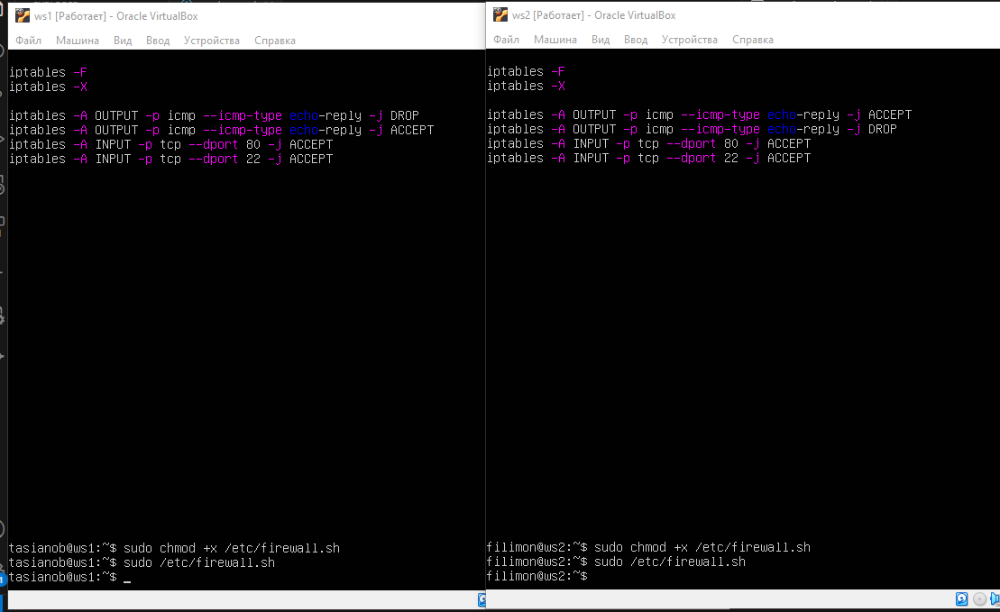

Пояснение:

1) iptables -F - очищает все правила в таблице фильтрации.
2) iptables -X - очищает все правила в таблице фильтрации.
3)  iptables -A OUTPUT -p icmp --icmp-type echo-reply -j DROP :
 * -A OUTPUT - добавляем правило в цепочку исходящего трафика
 * -p icmp - это означает, что правило применяется к протоколу ICMP (именно этот протокол используется для пинга).
* --icmp-type echo-reply - это конкретный тип ICMP-пакетов (echo-reply означает "ответ на пинг").
* -j DROP - говорит iptables просто отбросить пакет, то есть заблокировать.
4) iptables -A INPUT -p tcp --dport 22 -j ACCEP и iptables -A INPUT -p tcp --dport 80 -j ACCEPT:
* -A INPUT - добавляем правило в цепочку входящего трафика.
* -p tcp - правило применяется к TCP-пакетам.
* --dport 22 - это порт 22, который используется для SSH-подключений (доступ к серверу по командной строке).
* --dport 80 - это порт 80, который используется для HTTP (веб-сайты).
* -j ACCEPT - говорит iptables пропустить этот трафик.

**Запустите файлы на обеих машинах с помощью команд chmod +x /etc/firewall.shи /etc/firewall.sh**
- В отчёт помести скрины с запуском обоих файлов. 

- В отчёте опиши разницу между стратегиями, применёнными в первом и втором файлах.
 1) На WS1 была применена стратегия deny-first, при которой сначала запрещается ICMP-пинг, а потом разрешается
  - Запретить весь входящий трафик.

  - Разрешить входящий трафик только на порт 80 (HTTP) и 22 (SSH).
   - По умолчанию весь трафик блокируется, и только явно разрешённый трафик пропускается. 
 2) На WS2 была применена стратегия allow-first, при которой сначала разрешается ICMP-пинг, а потом запрещается
 - По умолчанию весь трафик разрешён, и только явно запрещённый трафик блокируется. 
 - Разрешить весь входящий трафик.

- Запретить входящий трафик на порт 

### 4.2. Утилита nmap 

Командой ping найди машину, которая не «пингуется», после чего утилитой nmap покажи, что хост машины запущен. 

Проверка: в выводе nmap должно быть сказано: **Host is up.**

В отчёт помести скрины с вызовом и выводом использованных команд ping и nmap.

## Part 5. Статическая маршрутизация сети
 
 1) ws1  
 

 2) ws21 

 3) ws22 
 

 4) r1  
  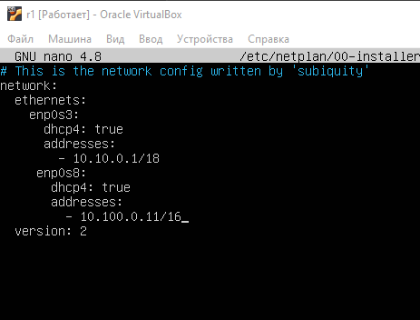

  5) r2 
   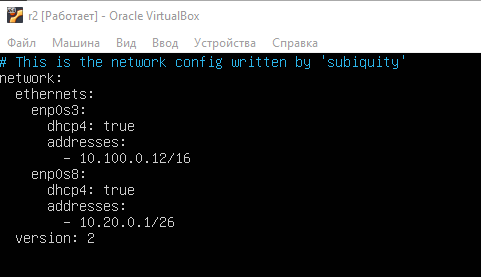

   - Перезапусти сервис сети. Если ошибок нет, командой ip -4 a проверь, что адрес машины задан верно. Также пропингуй ws22 с ws21. Аналогично пропингуй r1 с ws11.

   1. ping WS22 c WS21 

   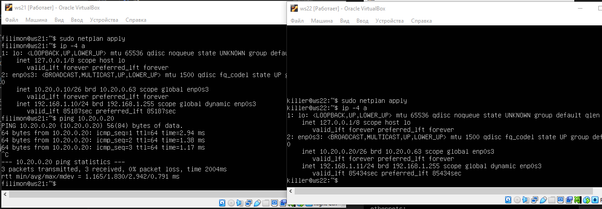

   2. ping r1 с ws11 

   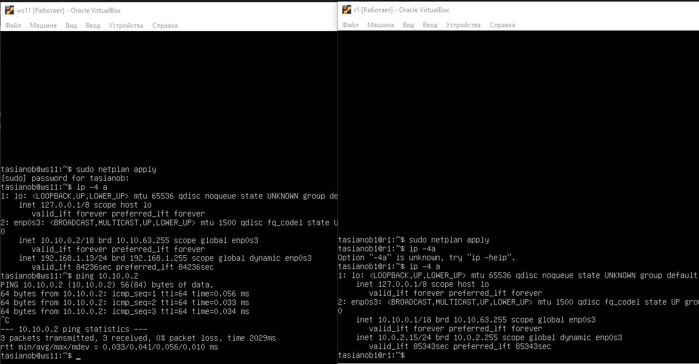

  ### 5.2. Включение переадресации IP-адресов 

  Чтобы включить IP-пересылку, выполните на маршрутизаторах следующую команду:
sysctl -w net.ipv4.ip_forward=1
При таком подходе переадресация не будет работать после перезагрузки системы.  

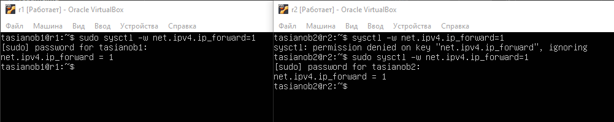

- Открой файл /etc/sysctl.conf и добавь в него следующую строку:
net.ipv4.ip_forward = 1 При использовании этого подхода, IP-переадресация включена на постоянной основе.  

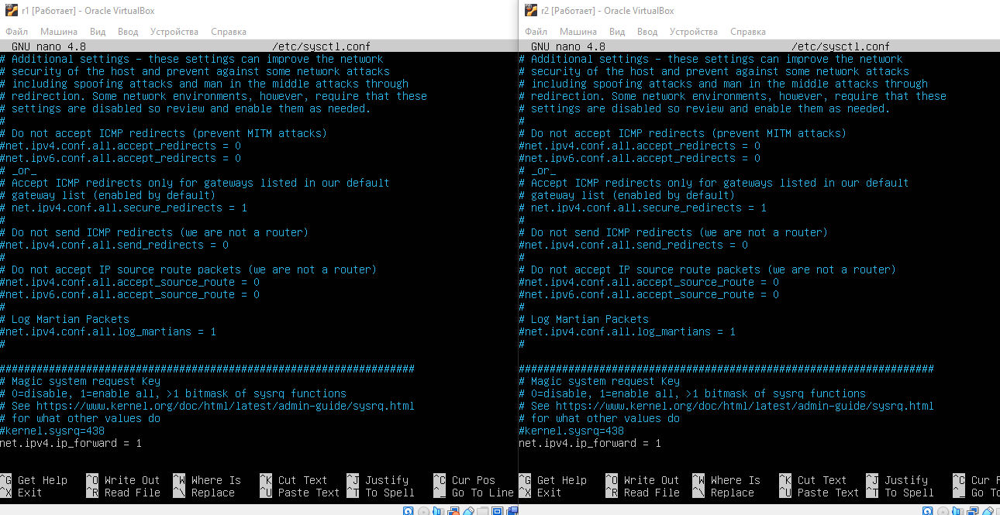

### 5.3. Установка маршрута по умолчанию

 - Настрой маршрут по умолчанию (шлюз) для рабочих станций. Для этого добавь default перед IP-роутера в файле конфигураций. 

 Добавьте в отчет снимок экрана файла etc/netplan/00-installer-config.yaml.  
 
 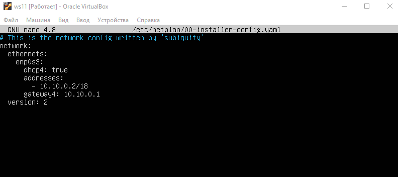

 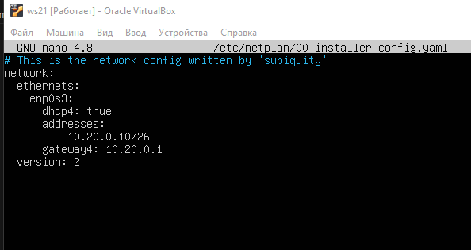

 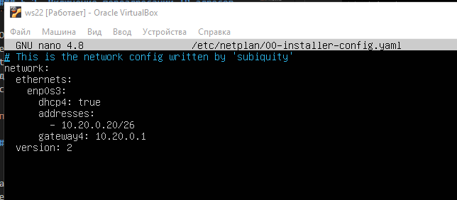

 gateway4 и есть конфиг маршрута по умолчанию!!!

 - Вызови ip r и покажи, что добавился маршрут в таблицу маршрутизации.
В отчёт помести скрин с вызовом и выводом использованной команды. <rb>
1. ws11<rb> 

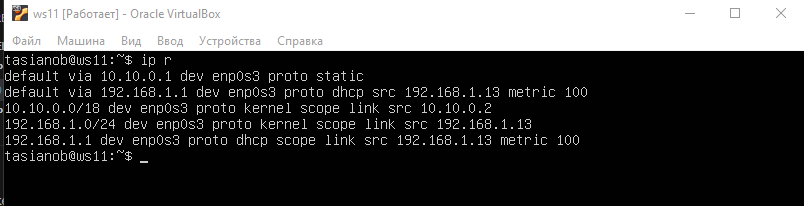<rb>
2. ws21 <rb>

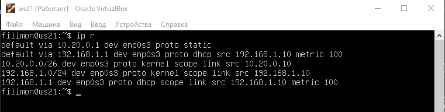<rb>

3. ws22 <rb>

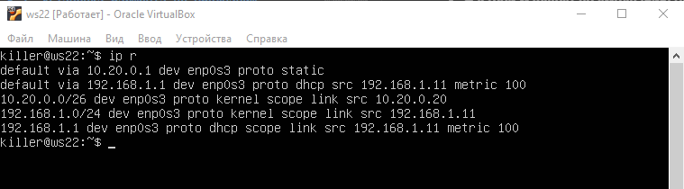<rb>

- Пропингуй с ws11 роутер r2 и покажи на r2, что пинг доходит. Для этого используй команду:
tcpdump -tn -i eth0

В отчёт помести скрин с вызовом и выводом использованных команд.<rb> 

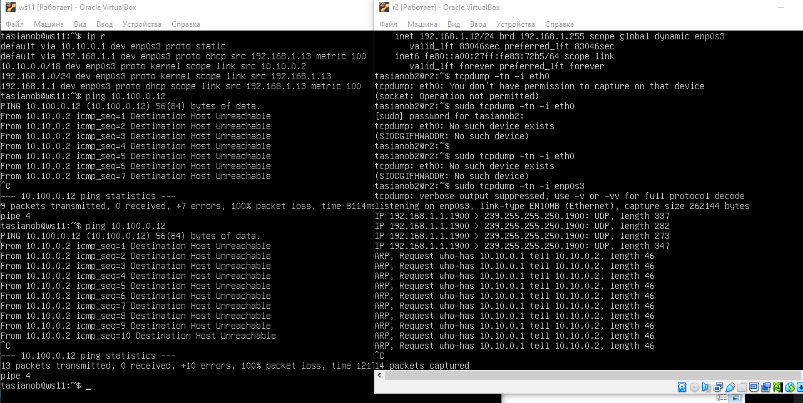<rb>

### 5.4. Добавление статических маршрутов 

- Добавь в роутеры r1 и r2 статические маршруты в файле конфигураций. Пример для r1 маршрута в сетку 10.20.0.0/26:<rb> 

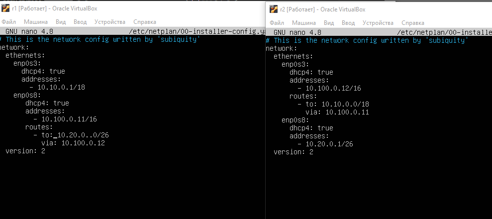<rb>

- Вызови ip r и покажи таблицы с маршрутами на обоих роутерах.<rb>

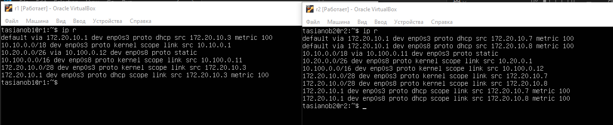
- Запусти команды на ws11:<rb>
ip r list 10.10.0.0/[маска сети] и ip r list 0.0.0.0/0<rb>

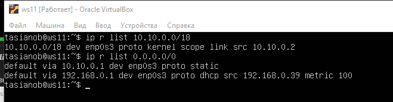
- Объясните в отчете, почему для 10.10.0.0/(netmask) был 
выбран другой маршрут, отличный от 0.0.0.0/0, хотя это мог быть маршрут по умолчанию.

- Маршрут 10.10.0.0/18 — это маршрут для локальной сети. Он будет использоваться для передачи данных в пределах этой сети без необходимости обращения к шлюзу
- Маршрут 0.0.0.0/0 — это маршрут по умолчанию. Он используется для всех адресов, которые не попадают в локальную сеть. Пакеты будут отправляться через указанный шлюз.

### 5.5. Построение списка маршрутизаторов

- Запусти на r1 команду дампа:
tcpdump -tnv -i enp0s3 <rb>

- При помощи утилиты traceroute построй список маршрутизаторов на пути от ws11 до ws21.<rb>
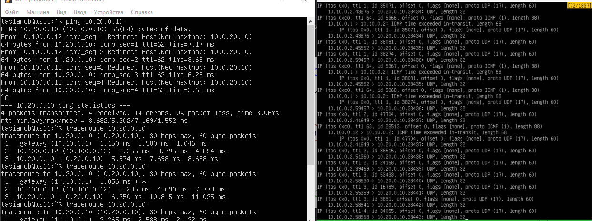

На основе вывода дампа на r1 объясните в отчете, как работает построение пути с помощью traceroute .
1. Первый шаг:
Traceroute отправляет пакет с TTL=1 на конечный IP. Этот пакет доходит до ближайшего маршрутизатора (R1).

R1 уменьшает TTL до 0.
Так как TTL=0, R1 отправляет обратно сообщение ICMP Time Exceeded.
2. Второй шаг:
Traceroute отправляет следующий пакет с TTL=2. Этот пакет доходит до следующего маршрутизатора (R2).

R2 также уменьшает TTL до 0 и отправляет ICMP-ответ обратно.
3. Следующие шаги:
Traceroute продолжает увеличивать TTL на 1 с каждым следующим запросом, пока пакет не достигнет конечной точки или не будет превышен лимит TTL.

### 5.6. Использование протокола ICMP при маршрутизации

Запустить на r1 захват сетевого трафика, проходящего через eth0 с tcpdump -n -i eth0 icmp команда.
Выполните пинг несуществующего IP-адреса (например, 10.30.0.111 ) с ws11 с помощью ping -c 1 10.30.0.111 команда.<rb>

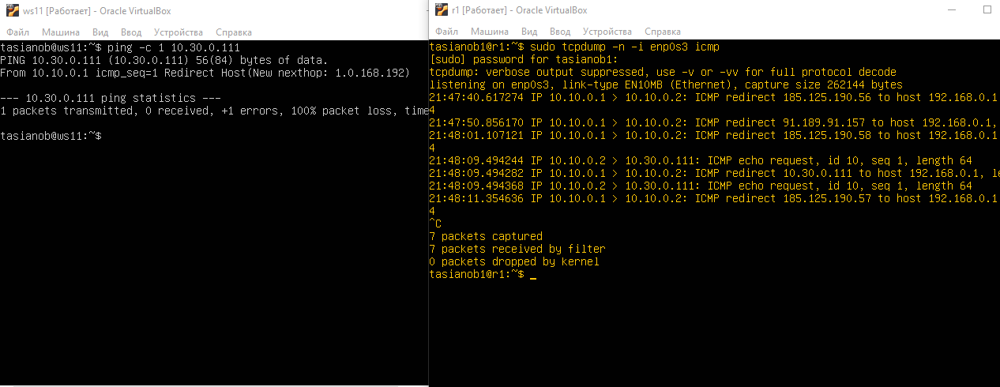

## Part 6. Динамическая настройка IP с помощью DHCP 

- Для r2 настрой в файле /etc/dhcp/dhcpd.conf конфигурацию службы DHCP:
1. Укажи адрес маршрутизатора по умолчанию, DNS-сервер и адрес внутренней сети. Пример файла для r2:<rb>
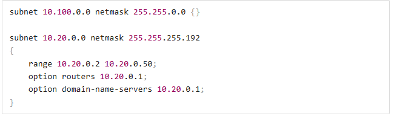
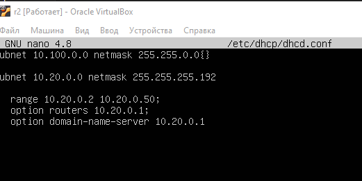

2. В файле resolv.conf пропиши nameserver 8.8.8.8.<rb>
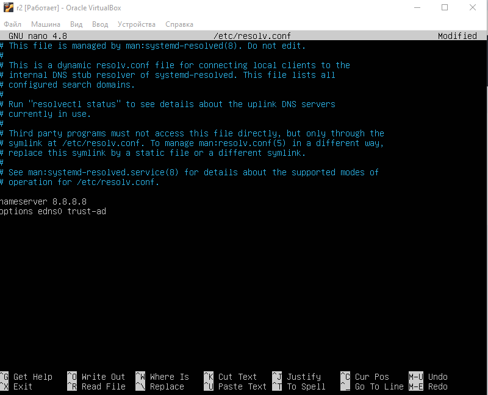

- Перезагрузи службу DHCP командой systemctl restart isc-dhcp-server. Машину ws21 перезагрузи при помощи reboot и через ip a покажи, что она получила адрес. Также пропингуй ws22 с ws21.<rb>

<rb>

- Укажи MAC-адрес у ws11, для этого в etc/netplan/00-installer-config.yaml надо добавить строки: macaddress: 10:10:10:10:10:BA, dhcp4: true.<rb>

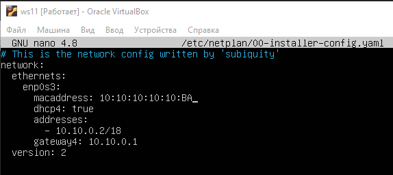<rb>

-Для r1 настрой аналогично r2, но сделай выдачу адресов с жесткой привязкой к MAC-адресу (ws11). Проведи аналогичные тесты.<rb>

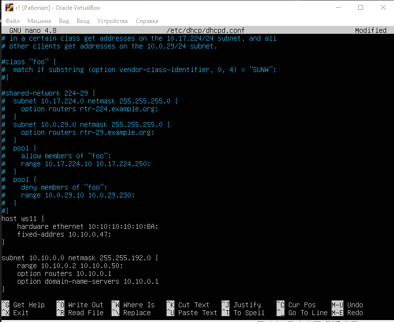<rb>

- Запроси с ws21 обновление IP-адреса.<rb>
ДО <rb>

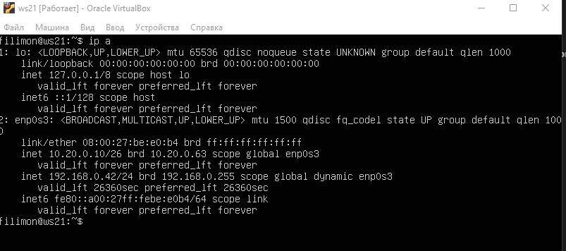<rb>

ПОСЛЕ <rb>

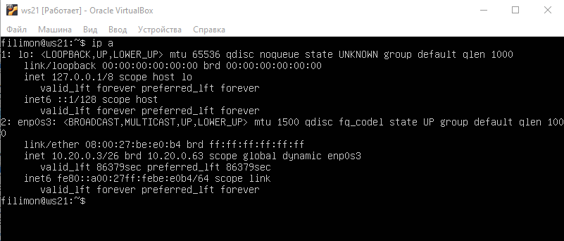<rb>

- Опишите в отчете, какие параметры DHCP- сервера использовались в этой точке.
Был IP-адресс из диапозона DHCP-сервера на машине r2. После нового запроса IP-адреса, IP-адрес выдал зи диапозона DHCP-сервер машины r1(как мы и описывали в конфигах)

## Part 7. NAT
 - В файле /etc/apache2/ports.conf измените строку Listen 80 на Listen 0.0.0.0:80 on ws22 и r1, т.е. сделайте сервер Apache2 публичным

 - Добавьте в отчет снимок экрана измененного файла.<rb>
 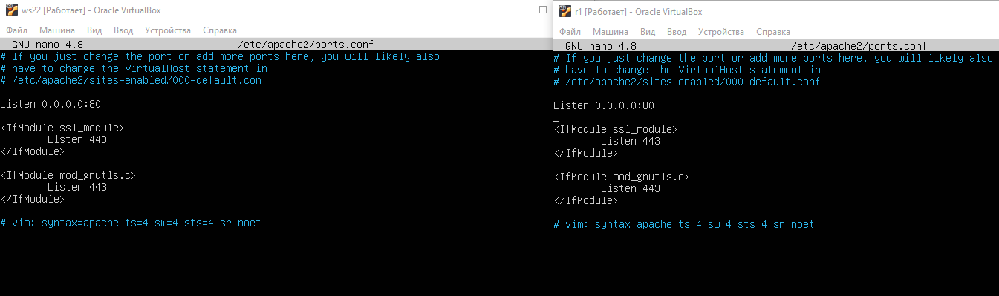
 -Запусти веб-сервер Apache командой service apache2 start на ws22 и r1.<rb>
 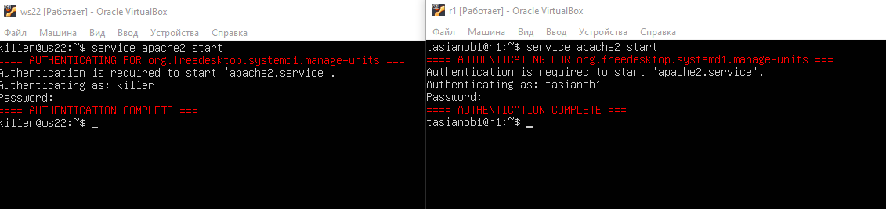

 -Добавь в фаервол, созданный по аналогии с фаерволом из Части 4, на r2 следующие правила:
1) Удаление правил в таблице filter — iptables -F;
2) Удаление правил в таблице «NAT» — iptables -F -t nat;
3) Отбрасывать все маршрутизируемые пакеты — iptables --policy FORWARD DROP.<rb>
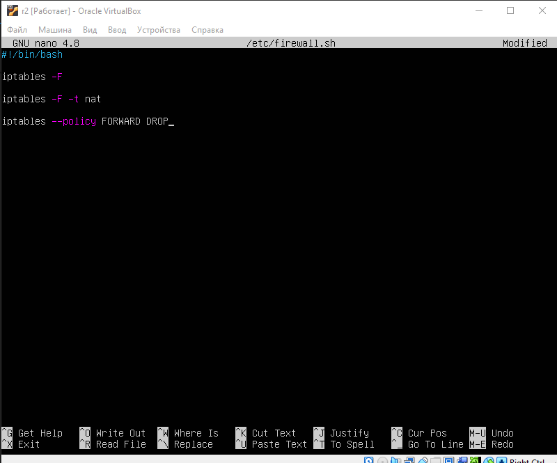

- Запустите файл, как в части 4.
При запуске файла с этими правилами ws22 не должен пинговаться с r1<rb>
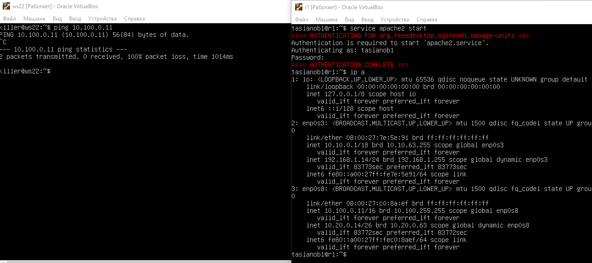<rb>

- Добавь в файл ещё одно правило:<rb>
4) Разрешить маршрутизацию всех пакетов протокола ICMP.<rb>

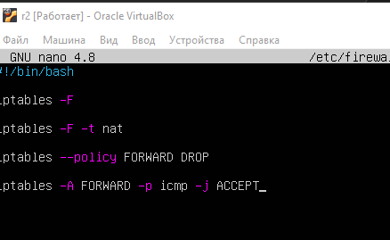<rb>
Запустите файл, как в части 4.<rb>
Проверьте соединение между ws22 и r1 с помощью pingкоманды<rb>

При запуске файла с этими правилами ws22 должен пинговаться с r1<rb>

<rb>

Добавьте в файл еще два правила:
включить SNAT , который маскирует все локальные IP-адреса из локальной сети за r2 (как определено в части 5 — сеть 10.20.0.0)

5) Включи SNAT, а именно маскирование всех локальных IPиз локальной сети, находящейся за r2 (по обозначениям из Части 5 — сеть 10.20.0.0).
Совет: стоит подумать о маршрутизации внутренних пакетов, а также внешних пакетов с установленным соединением.

6) Включи DNAT на 8080 порт машины r2 и добавить к веб-серверу Apache, запущенному на ws22, доступ извне сети.
Совет: стоит учесть, что при попытке подключения возникнет новое tcp-соединение, предназначенное ws22 и 80 порту.<rb>

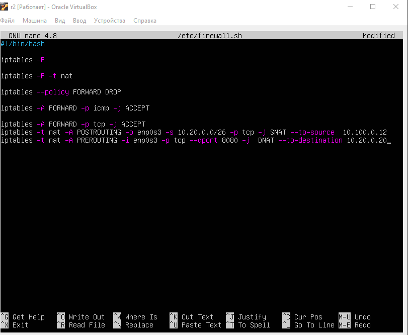<rb>

- Запусти файл также, как в Части 4.<rb>
Перед тестированием рекомендуется отключить сетевой интерфейс NAT (его наличие можно проверить командой ip a) в VirtualBox, если он включен.
Проверьте TCP-соединение для SNAT , подключившись из ws22 к серверу Apache на r1 с помощью telnet [address] [port] команды. <rb> 

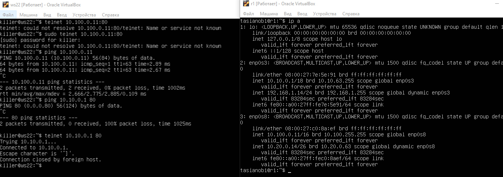<rb>

- Проверь соединение по TCP для DNAT: для этого с r1 подключиться к серверу Apache на ws22 командой telnet (обращаться по адресу r2 и порту 8080).<rb>

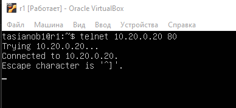

## Part 8. Дополнительно. Знакомство с SSH Tunnels 

Запустите брандмауэр на r2 с правилами из Части 7.
Запустите веб-сервер Apache на ws22 только на локальном хосте (т.е. в файле /etc/apache2/ports.conf измените строку Listen 80 на Listen localhost:80)<rb>

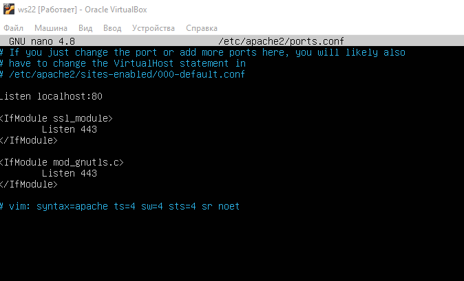<rb>

Используйте локальную переадресацию TCP с ws21 на ws22 для доступа к веб-серверу на ws22 из ws21
ws21 на ws22<rb>

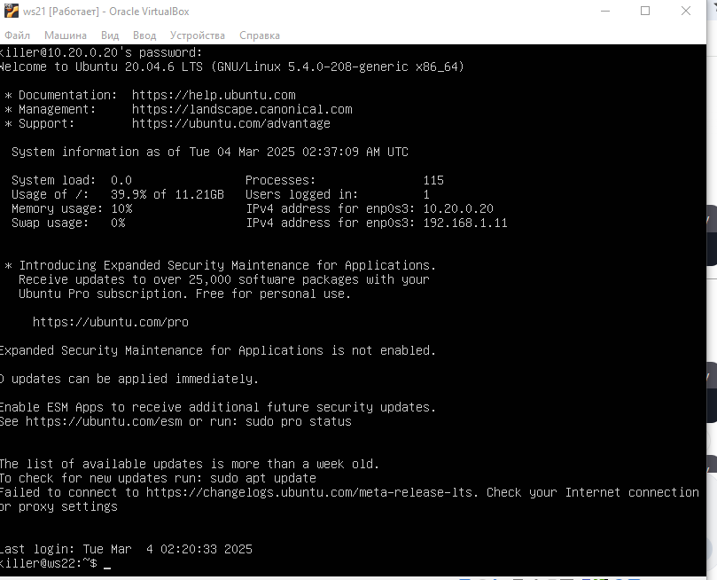<rb>

Apache работает локально на 80 порту<rb>

<rb>

Используйте удаленную переадресацию TCP с ws11 на ws22 для доступа к веб-серверу на ws22 из ws11
- В отчете опишите команды, которые вам понадобятся для выполнения этих 4 шагов, и добавьте скриншоты их вызова и вывода.
1. Открыл /etc/apache2/ports.conf на ws22 и поменял строчку, какой порт мониторится на Listen localhost:80
2. На ws22 утсновил openssh-server командой sudo apt install openssh-server
3. На ws22 зашёл в конфиг openssh-server по пути /etc/ssh/sshd_config и раскомментировал строчку ListenAddresses 0.0.0.0 для того, что бы ssh сервер мониторил все интрефейсы
4. После перезапустил службы Apache2 и SSH-server на ws22 командами sudo systemctl restart apache2 и sudo systemctl restart ssh
5. На ws21 командой ssh -L 8080:127.0.0.1:80 killer10.20.0.20(ip ws22) локлаьная пререадресация порта, для перенаправления трафика с локальной машины ws21 на определённый порт удалённой машины ws22
.